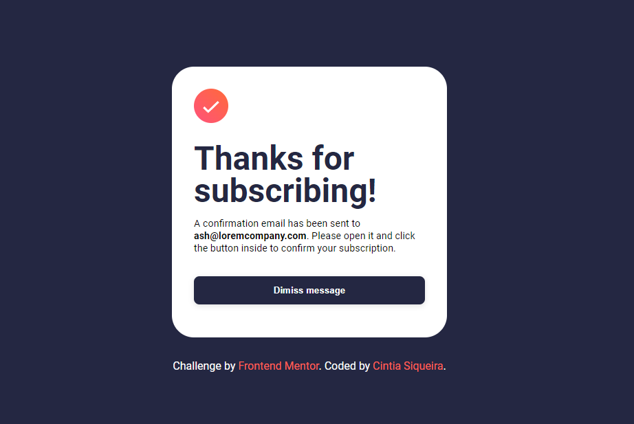

# Frontend Mentor - Newsletter sign-up form with success message solution

This is a solution to the [Newsletter sign-up form with success message challenge on Frontend Mentor](https://www.frontendmentor.io/challenges/newsletter-signup-form-with-success-message-3FC1AZbNrv). Frontend Mentor challenges help you improve your coding skills by building realistic projects.

## Table of contents

- [Overview](#overview)
  - [The challenge](#the-challenge)
  - [Screenshot](#screenshot)
  - [Links](#links)
- [My process](#my-process)
  - [Built with](#built-with)
  - [What I learned](#what-i-learned)
  - [Useful resources](#useful-resources)
- [Author](#author)

**Note: Delete this note and update the table of contents based on what sections you keep.**

## Overview

### The challenge

Users should be able to:

- Add their email and submit the form
- See a success message with their email after successfully submitting the form
- See form validation messages if:
  - The field is left empty
  - The email address is not formatted correctly
- View the optimal layout for the interface depending on their device's screen size
- See hover and focus states for all interactive elements on the page

### Screenshot

### Links

- Solution URL: [Click here](https://github.com/ciisiq/challenge-preview-card-component)
- Live Site URL: [Click here](https://ciisiq.github.io/challenge-newsletter-sign-up/)

## My process

### Built with

- Semantic HTML5
- CSS custom properties
- Flexbox

### What I learned

It was again a good recap for DOM Element with Javascript and simple CSS.

### Useful resources

- [Recap DOM](https://www.w3schools.com/jsref/met_document_getelementsbyclassname.asp) - Again always nice to recap;
- [Reset form](https://www.tutorialspoint.com/how-to-clear-the-form-after-submitting-in-javascript-without-using-reset#:~:text=In%20JavaScript%2C%20we%20have%20used,method%20on%20submitting%20an%20event.&text=We%20have%20successfully%20learned%20three,to%20clear%20the%20whole%20form.) - This helped me how to reset the form;

## Author

- Website - [Cintia Siqueira](https://github.com/ciisiq)
- Frontend Mentor - [@ciisiq](https://www.frontendmentor.io/profile/ciisiq)
